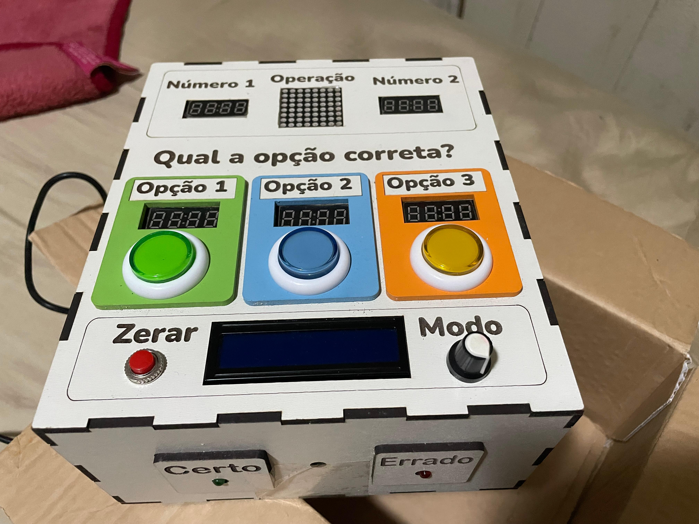
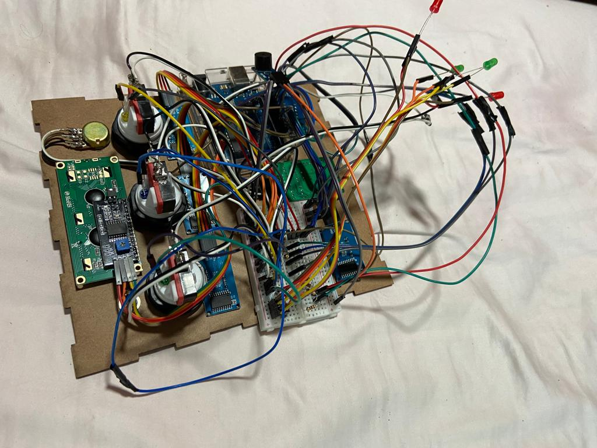
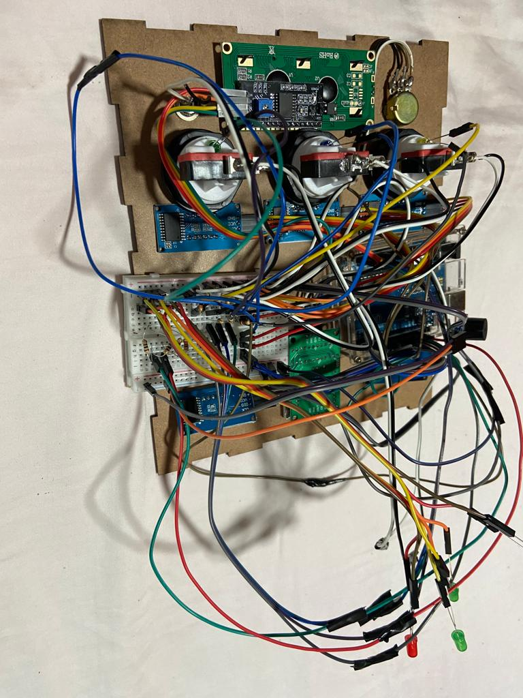
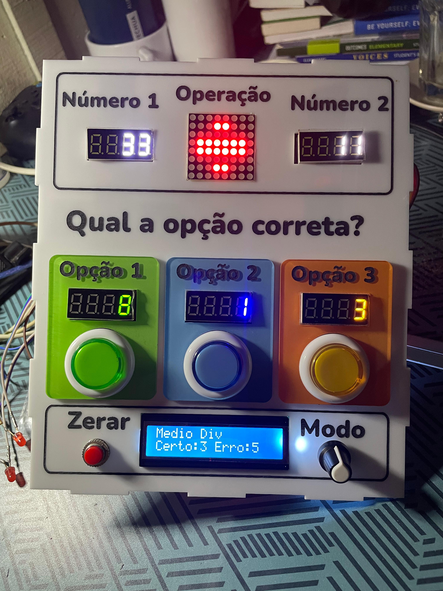
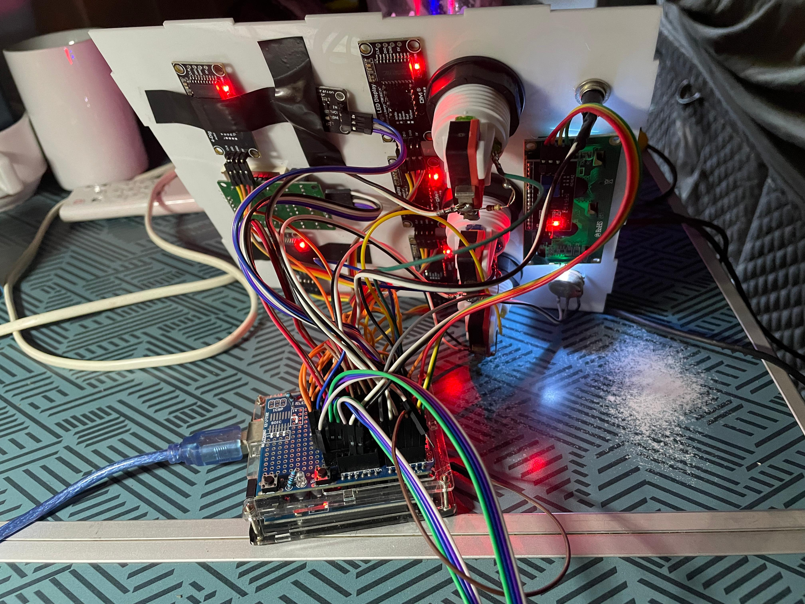
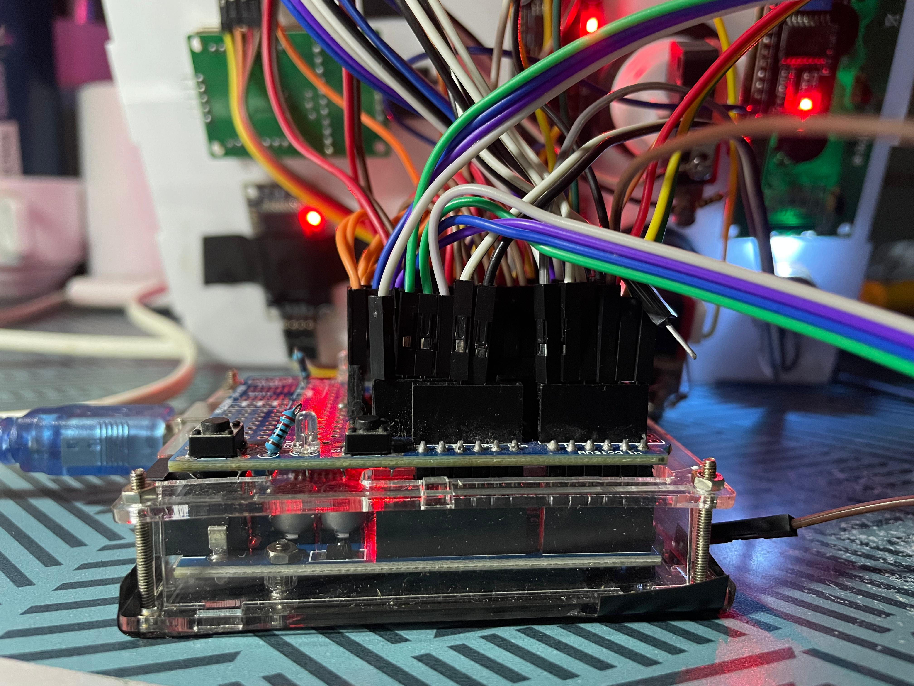
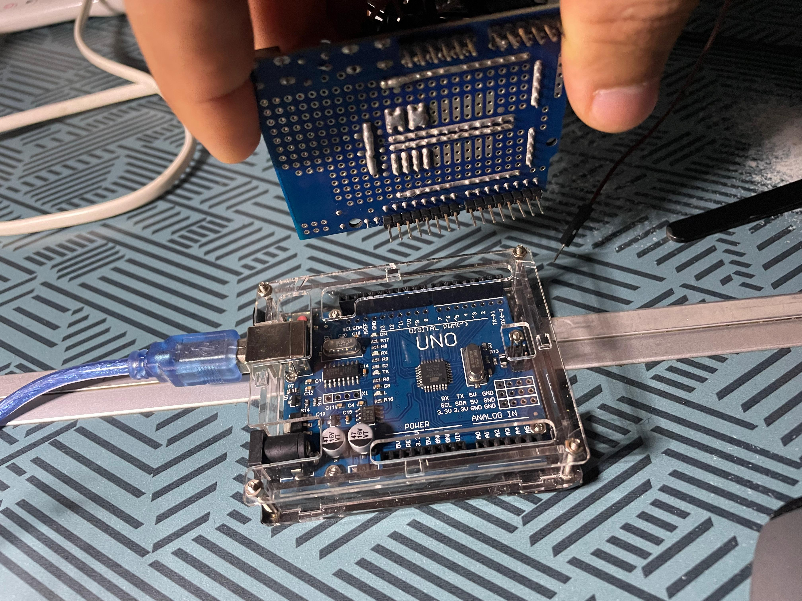
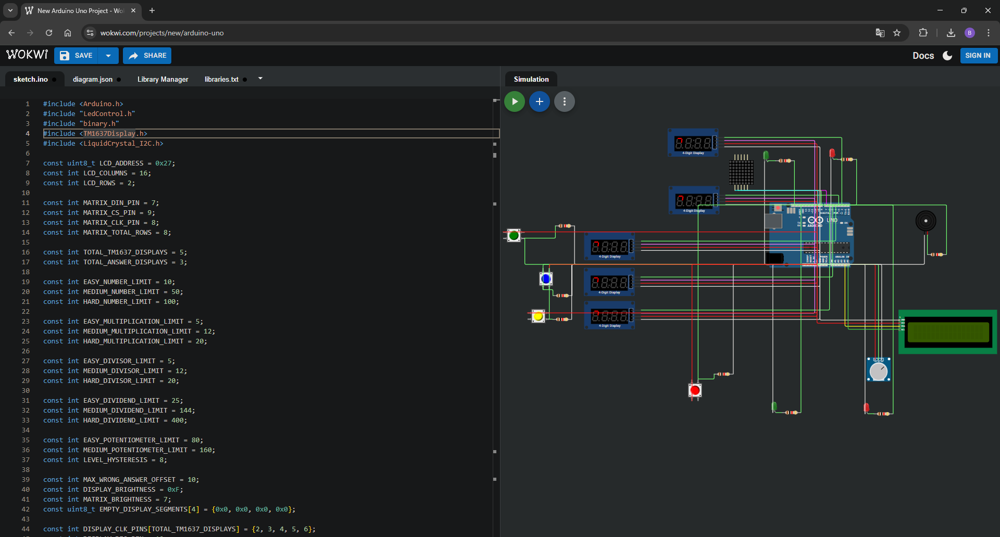

# Maths Quiz Game

[](https://github.com/DegsTerin/Maths_Quiz_Game)
[](https://github.com/sponsors/DegsTerin)
[](https://www.arduino.cc/en/Main/ArduinoBoardUno)
[](https://wokwi.com/projects/new/arduino-uno)
[](https://github.com/DegsTerin/Maths_Quiz_Game/releases/tag/v1.1.0)

An interactive Arduino-based maths quiz system with adaptive difficulty, multiple display modules, physical answer buttons, score tracking, and a complete Wokwi simulation setup.

## Support

If this project helps you, consider sponsoring ongoing development:

- GitHub Sponsors: `https://github.com/sponsors/DegsTerin`

## Project summary

This project presents arithmetic challenges using dedicated hardware modules:

- two TM1637 displays for the operands
- three TM1637 displays for the answer options
- one 8x8 LED matrix for the selected operation
- one 16x2 I2C LCD for level and score feedback
- three answer buttons, one reset button, and one potentiometer for difficulty selection

Main sketches:

- English (en-gb) - with decimal rounds: `arduino/maths-quiz-game-en-gb/maths-quiz-game-en-gb.ino`
- English (en-gb) - integers only (no decimal rounds): `arduino/maths-quiz-game-en-gb-integers/maths-quiz-game-en-gb-integers.ino`
- Portuguese (pt-br) - with decimal rounds: `arduino/maths-quiz-game-pt-br/maths-quiz-game-pt-br.ino`
- Portuguese (pt-br) - integers only (no decimal rounds): `arduino/maths-quiz-game-pt-br-integers/maths-quiz-game-pt-br-integers.ino`

## Gallery

### Finished build



### Prototype during assembly





### Demonstration preview


[Open the full demonstration video](assets/media/demonstration.mp4)

## Features

- Addition, subtraction, multiplication, and division
- Three difficulty levels: easy, medium, and hard
- Animated operation selection on the 8x8 LED matrix
- Three multiple-choice answers shown on TM1637 displays
- Button color LEDs can light up immediately when each button is pressed
- Right and wrong feedback using dedicated LEDs
- Right and wrong score tracking on the I2C LCD
- Potentiometer-based difficulty selection
- Browser-based simulation support with Wokwi

## Hardware used

- 1 Arduino board
- 1 I2C 16x2 LCD at address `0x27`
- 1 8x8 LED matrix using a `LedControl`-compatible driver
- 5 four-digit TM1637 displays
- 3 answer buttons
- 1 reset button
- 1 potentiometer
- 2 feedback LEDs
- 3 button indicator LEDs (or illuminated button LEDs)
- 1 protoboard module / protoshield module for wiring integration
- No external resistors for the answer/reset buttons (`INPUT_PULLUP` is used)

## Pin mapping

Configuration defined in the sketch:

- 8x8 matrix
  - `DIN`: pin `7`
  - `CLK`: pin `8`
  - `CS`: pin `9`
- TM1637 displays
  - Shared DIO: pin `10`
  - CLK display 1: pin `2`
  - CLK display 2: pin `3`
  - CLK display 3: pin `4`
  - CLK display 4: pin `5`
  - CLK display 5: pin `6`
- Answer buttons
  - Button 1: `A1`
  - Button 2: `A2`
  - Button 3: `A3`
- Reset button: pin `11`
- Right LED: pin `12`
- Wrong LED: pin `13`
- Potentiometer: `A0`

Optional feedback module on wrong answer output:

- You can connect an active buzzer module (bip) or a vibracall vibration module together with the wrong LED signal on pin `13` (using the module input + `GND`) for audible or haptic feedback.

Construction and enclosure variants:

- Main build version in MDF
- Second build version in acrylic

## Additional build photos

### Acrylic enclosure version



### Rear wiring with protoshield/protoboard module







Important wiring update:

- Answer and reset buttons now use `INPUT_PULLUP`
- Pressed state is `LOW`
- Each button must be wired between input pin and `GND`
- External 10k pull-down resistors are no longer required for these buttons

## How the game works

1. The potentiometer sets the current difficulty level.
2. The system selects an operation and animates it on the 8x8 matrix.
3. Two displays show the operands.
4. Three displays show the answer options.
5. The player presses one of the three answer buttons.
6. The system updates the score and shows right or wrong feedback.
7. The reset button clears the score and restarts the cycle.

## Difficulty behaviour

The generated values change according to the selected level:

- Easy: smaller values and a higher chance of simpler calculations
- Medium: wider ranges and a more balanced mix of operations
- Hard: larger values and a stronger weighting towards multiplication and division

Decimal behaviour by sketch variant:

- Decimal variant (`maths-quiz-game-en-gb.ino` and `maths-quiz-game-pt-br.ino`):
  - Easy: 10% of rounds may include decimal operands/results
  - Medium: 20%
  - Hard: 30%
- Integer-only variant (`maths-quiz-game-en-gb-integers.ino` and `maths-quiz-game-pt-br-integers.ino`):
  - No decimal operands
  - No decimal results
  - Division is generated to keep integer results

## Libraries

Libraries used by the sketch:

- `TM1637Display`
- `LiquidCrystal_I2C`
- `LedControl`

Libraries included in the repository:

- `arduino/libraries/TM1637_Driver`
- `arduino/libraries/LiquidCrystal_I2C`

Note: the sketch includes `LedControl.h`, but that library is not versioned in this repository. If it is missing in your Arduino environment, install it manually.

## Repository structure

```text
arduino/
|-- libraries/
|   |-- LiquidCrystal_I2C/
|   `-- TM1637_Driver/
|-- maths-quiz-game-en-gb/
|   `-- maths-quiz-game-en-gb.ino
|-- maths-quiz-game-en-gb-integers/
|   `-- maths-quiz-game-en-gb-integers.ino
|-- maths-quiz-game-pt-br/
|   `-- maths-quiz-game-pt-br.ino
`-- maths-quiz-game-pt-br-integers/
    `-- maths-quiz-game-pt-br-integers.ino

assets/
`-- media/
    |-- acrylic-front.png
    |-- acrylic-rear-wiring.png
    |-- arduino-protoshield.png
    |-- maths-quiz-game-cover.png
    |-- assembly-front.jpg
    |-- assembly-top.jpg
    |-- demonstration.gif
    |-- demonstration.mp4
    `-- protoshield-close.png

design/
`-- vector/
    |-- maths-box.ai
    `-- maths-box-v8.ai

docs/
|-- project-tutorial.docx
|-- release-v1.0.0.md
`-- release-v1.1.0.md

hardware/
`-- electronics/
    |-- maths-quiz-game.pdf
    |-- maths-quiz-game.psd
    `-- supporting files

simulation/
|-- diagram.json
|-- libraries.txt
|-- wokwi.png
`-- wokwi-project.txt
```

## Run on hardware

1. Open the Arduino IDE.
2. Install the required libraries if needed.
3. Open one sketch folder:
   - `arduino/maths-quiz-game-en-gb/` or
   - `arduino/maths-quiz-game-en-gb-integers/` or
   - `arduino/maths-quiz-game-pt-br/` or
   - `arduino/maths-quiz-game-pt-br-integers/`
4. Connect the Arduino board.
5. Compile and upload the sketch.

## Simulate in Wokwi

You can start from the Arduino Uno template:

`https://wokwi.com/projects/new/arduino-uno`

Recommended setup:

1. Create a new Arduino Uno project in Wokwi.
2. Replace the default `sketch.ino` by copying code from one of:
   - `arduino/maths-quiz-game-en-gb/maths-quiz-game-en-gb.ino`
   - `arduino/maths-quiz-game-en-gb-integers/maths-quiz-game-en-gb-integers.ino`
   - `arduino/maths-quiz-game-pt-br/maths-quiz-game-pt-br.ino`
   - `arduino/maths-quiz-game-pt-br-integers/maths-quiz-game-pt-br-integers.ino`
3. Replace the default `diagram.json` with `simulation/diagram.json`.
4. Replace or create `libraries.txt` using `simulation/libraries.txt`.
5. Confirm that `TM1637Display`, `LiquidCrystal_I2C`, and `LedControl` are available in the project.
6. Start the simulation.

Notes:

- The LCD address used by this project is `0x27`.
- All local Wokwi files are stored in `simulation/`.
- `simulation/wokwi-project.txt` stores the Wokwi project link or reference details.
- If a required library is missing, the simulation will not compile.



## Supporting materials

The repository also includes:

- electronics files in `hardware/electronics`
- vector design files in `design/vector`
- a project tutorial document in `docs/project-tutorial.docx`
- prototype photos and media in `assets/media`
- complete Wokwi simulation files in `simulation`

## Notes

- This project is released under the MIT License. See `LICENSE`.
- The repository combines source code, design assets, electronics documentation, and simulation files in one place.
- The file `hardware/electronics/maths-quiz-game.txt` appears to use inconsistent encoding and was not treated as a primary documentation source.


